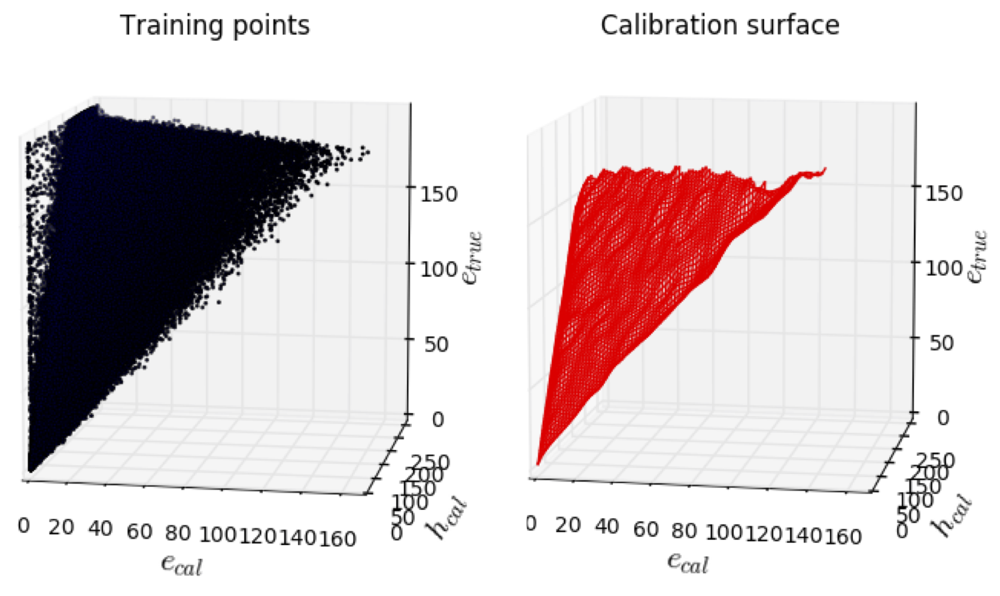
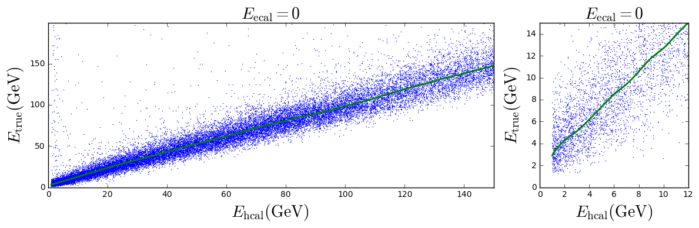
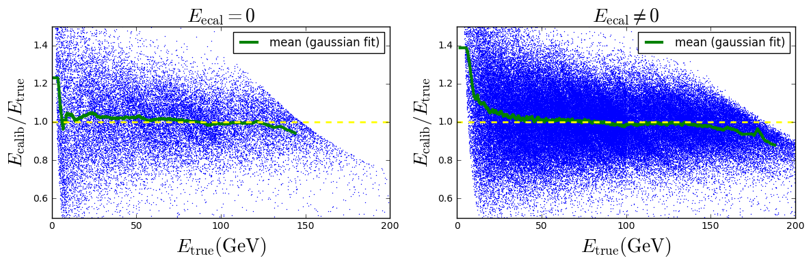
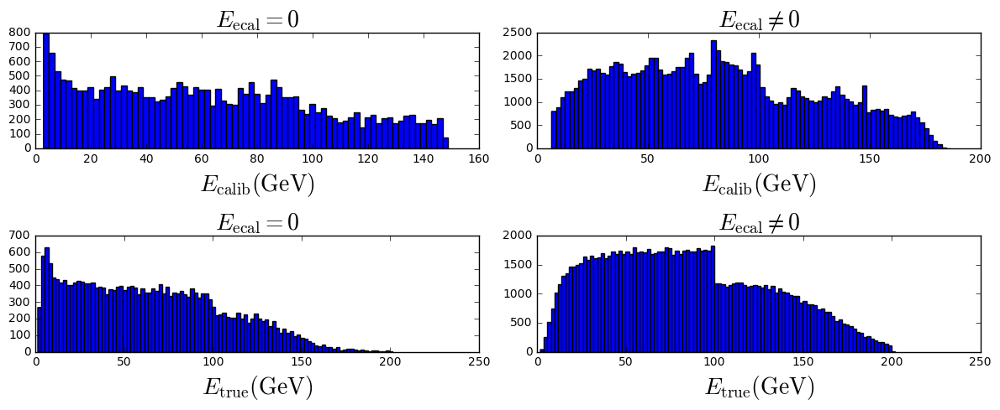
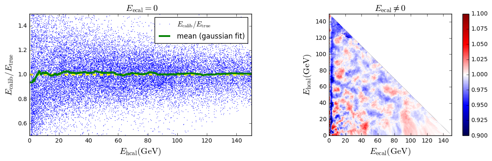
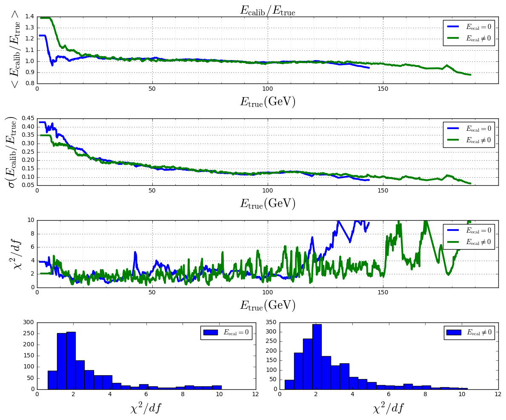

# How does it works
For the particles flow, we need to know the energies of the particles thanks to the hadronic calorimeter and electromagnetic calorimeter.
We use simulated particles to creates models to obtains a calibrated energy thanks to simulated particles.



## Root file to python
First of all you have to install [ROOT](https://root.cern.ch).

After, if you have a root file with simulated particles, you have to convert them in a python file understandable by the program.

For this you have to use the program '`convertRootFile.py`'

Step 1 : make the file as executable

```shell
chmod +x convertRootFile.py
```

Step 2 : launch the program

example with `prod2_200_400k.root` and `charged_hadrons_100k.root`

```shell
./convertRootFile.py prod2_200_400k.root charged_hadrons_100k.root
```

Step 3 : you can use the new files in '`.energydata`' in the other programs

## To create a calibration
### Importation of data
To create your calibration, you need simulated particles in a '`.energydata`' binary file (see above).

This introduces to you some useful methods to import this data.
```python
from pfcalibration.tools import importData # to import binary data

#importation of simulated particles
filename = 'charged_hadrons_100k.energydata'
data1 = importData(filename)
filename = 'prod2_200_400k.energydata'
data2 = importData(filename)
# we merge the 2 sets of data
data1 = data1.mergeWith(data2)
# we split the data in 2 sets
data1,data2 = data1.splitInTwo()
#data 1 -> training data
#data 2 -> data to predict
```

### Example with calibration method
```python
# parameters of the calibration
lim = 150                   # if ecal + hcal > lim, ecalib = math.nan
n_neighbors_ecal_eq_0=2000  # number of neighbors for ecal = 0
n_neighbors_ecal_neq_0=250  # number of neighbors for ecal ≠ 0
energystep_ecal_eq_0 = 1
energystep_ecal_neq_0 = 5
    

# We create the calibration
calibration = data1.KNNGaussianFit(n_neighbors_ecal_eq_0=n_neighbors_ecal_eq_0,
                             n_neighbors_ecal_neq_0=n_neighbors_ecal_neq_0,
                             lim=lim,energystep_ecal_eq_0=energystep_ecal_eq_0,energystep_ecal_neq_0=energystep_ecal_neq_0,kind='cubic')
```

If you have the `ecal`,`hcal`,`etrue` variables in 3 arrays you can also do :
```python
from pfcalibration.KNNGaussianFit import KNNGaussianFit

ecal = ...
hcal = ...
etrue = ...

# parameters of the calibration
lim = 150                   # if ecal + hcal > lim, ecalib = math.nan
n_neighbors_ecal_eq_0=2000  # number of neighbors for ecal = 0
n_neighbors_ecal_neq_0=250  # number of neighbors for ecal ≠ 0
energystep_ecal_eq_0 = 1
energystep_ecal_neq_0 = 5
    

# We create the calibration
calibration = KNNGaussianFit(ecal,hcal,etrue,n_neighbors_ecal_eq_0=n_neighbors_ecal_eq_0,
                             n_neighbors_ecal_neq_0=n_neighbors_ecal_neq_0,
                             lim=lim,energystep_ecal_eq_0=energystep_ecal_eq_0,energystep_ecal_neq_0=energystep_ecal_neq_0,kind='cubic')
```
See : [create_all_calibration.py](create_all_calibration.py), [example_KNNGF.py](example_KNNGF.py)

## To save or to import a calibration
Because creating a calibration could be long, once it is done, you can save it in a binary file to use it later.
### To save
```python
calibration.saveCalib()
```
See : [create_all_calibration.py](create_all_calibration.py)
### To import
We can use `pfcalibration.tools.importCalib` to import an already saved calibration.
```python
from pfcalibration.tools import importCalib # to import binary data

# We import the calibration
filename = "calibrations/KNNGaussianFit_162Kpart_hcal_train_ecal_eq_0_min_1.00043606758_lim_150_n_neighbors_ecal_eq_0_2000_n_neighbors_ecal_neq_0_250.calibration"
calibration = importCalib(filename)
```
See : [example_KNNGF.py](example_KNNGF.py)

## To use a calibration
```python
# with one point
ecal = 60
hcal = 60
ecalib = calibration.predict(ecal,hcal)
```

```python
# with a numpy array
ecal = np.arange(0,lim,1)
hcal = np.arange(0,lim,1)
ecalib = calibration.predict(ecal,hcal)
```

```python
# with a meshgrid
ecal = np.arange(0,lim,1)
hcal = np.arange(0,lim,1)
ecal,hcal = np.meshgrid(ecal,hcal)
ecalib = calibration.predict(ecal,hcal)
```

## Usual plots
```python
import matplotlib.pyplot as plt
import pfcalibration.usualplots as usplt  # usual plots function 
from pfcalibration.tools import savefig   # to save a figure

classname = calibration.classname
# file to save the pictures
directory = "pictures/testcalibration/"
```

```python
# calibration curve for ecal = 0
fig = plt.figure(figsize=(10,4))
usplt.plotCalibrationCurve(calibration)
plt.show()
savefig(fig,directory,classname+"_calibration.png")
```



```python
# ecalib/true in function of etrue
fig = plt.figure(figsize=(10,4))
usplt.plot_ecalib_over_etrue_functionof_etrue(calibration,data2)
plt.show()
savefig(fig,directory,classname+"_ecalib_over_etrue.png")
```



```python
# histogram of ecalib and etrue
fig = plt.figure(figsize=(10,8))
usplt.hist_ecalib(calibration,data2)
plt.show()
savefig(fig,directory,classname+"_histograms_ecalib_etrue.png")
```



```python
# ecalib/etrue in function of ecal,hcal
fig = plt.figure(figsize=(10,5))
usplt.plot_ecalib_over_etrue_functionof_ecal_hcal(calibration,data2)
plt.show()
savefig(fig,directory,classname+"_ecalib_over_etrue_functionof_ecal_hcal.png")
```



```python
# ecalib/etrue gaussian fit curve
fig = plt.figure(figsize=(10,12))
usplt.plot_gaussianfitcurve_ecalib_over_etrue_functionof_ecal_hcal(calibration,data2)
plt.show()
savefig(fig,directory,classname+"_ecalib_over_etrue_curve.png")
```

See : [example_KNNGF.py](example_KNNGF.py)